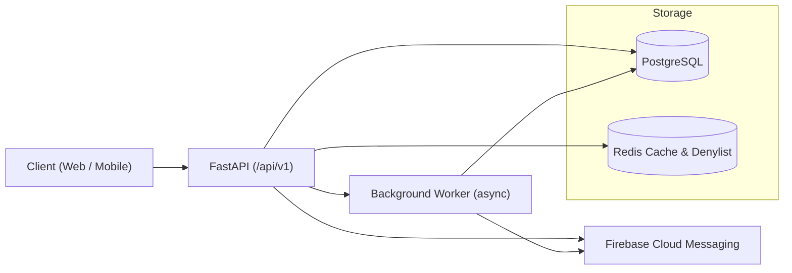

# FastAPI Todos 🚀

[](https://example.com)
[](https://www.python.org/)
[](https://www.docker.com/)
[](LICENSE)
[](https://redis.io/)
[](https://firebase.google.com/)

A high-performance, production-grade Todo API backend.  
This project showcases **Clean Architecture**, **Distributed Caching**, and **Real-time Notifications** to support modern mobile and web applications.

---

## ✨ Features

- 📶 **API Versioning**  
  Standardized `/api/v1/` prefix for future-proof mobile client support.

- ⚡ **Distributed Caching**  
  Integration with Redis using `fastapi-cache` to slash database load and response times.

- 🔔 **Real-time Reminders**  
  Firebase Cloud Messaging (FCM) integration for push notifications.

- 🤖 **Background Workers**  
  Asynchronous reminder service that checks for due tasks without blocking the main API.

- 📂 **Hierarchical Organization**  
  Support for Categories (Labels/Folders) with custom hex colors and Sub-tasks (Checklists).

- 🌍 **Global Timezone Sync**  
  Strict UTC internal handling to ensure reminders are accurate across all world timezones.

- 🛡️ **Enhanced Security**  
  JWT-based session management with a Redis-backed token denylist for secure logouts.

---

## 🛠️ Tech Stack

- **Framework:** FastAPI  
- **Cache & Denylist:** Redis  
- **Notifications:** Firebase Admin SDK  
- **Background Tasks:** Python asyncio Event Loop (or Celery/RQ for heavier workloads)  
- **ORM & Migrations:** SQLAlchemy 2.0 & Alembic  
- **Database:** PostgreSQL  

---

## ⚙️ Environment Configuration

```env
PROJECT_NAME="Fred-Todos-Pro"
DATABASE_URL="postgresql://postgres:password@db:5432/todos_db"
REDIS_URL="redis://redis:6379/0"
SECRET_KEY="your-complex-secret"
ALGORITHM="HS256"
ACCESS_TOKEN_EXPIRE_MINUTES=30
REFRESH_TOKEN_EXPIRE_DAYS=7
FCM_SERVICE_ACCOUNT_PATH="./serviceAccountKey.json"
```

---

## 📁 Modular Project Structure

```plaintext
fastapi-todos/
├── app/
│   ├── core/           
│   │   ├── cache.py          # Redis custom key builders and cache helpers
│   │   ├── worker.py         # Background reminder ticker
│   │   └── notifications.py  # FCM Logic
│   ├── todos/          
│   │   ├── models.py         # Multi-table schema (Todo, Category, SubTask)
│   │   ├── repository.py
│   │   ├── service.py
│   │   └── router.py
│   └── users/          
│       ├── dependencies.py   # Auth & Redis denylist check
│       └── router.py
├── tests/              
│   ├── test_users.py         # Specialized Auth tests
│   └── test_todos.py         # Domain logic & Pagination tests
├── docker-compose.yml
├── Dockerfile
├── alembic/
└── serviceAccountKey.json    # Firebase credentials (Git-ignored!)
```

---

## 📖 API Documentation

Access the upgraded v1 documentation locally:

- **Swagger UI:** http://localhost:8000/docs  
- **Prefix:** All endpoints are located at `/api/v1/`

---

## 🏗️ Architecture Diagram

Below are two formats — a Mermaid diagram (works where Mermaid is supported) and an ASCII fallback.



### ASCII Fallback

```
  +------------------------+         +-------------+       +-----------+
  | Client (Web/Mobile)    |  --->   | FastAPI API |  ---> | PostgreSQL|
  +------------------------+         +------^------+       +-----------+
                                           |
                                 +---------+----------+
                                 | Redis (cache/denylist) |
                                 +-----------------------+
                                           |
                                     +-----v------+
                                     |  Worker    |
                                     | (background)|
                                     +-----+------+
                                           |
                                         FCM (push)
```